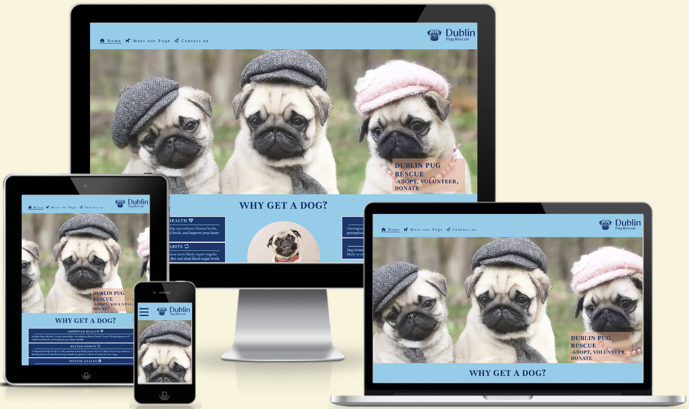
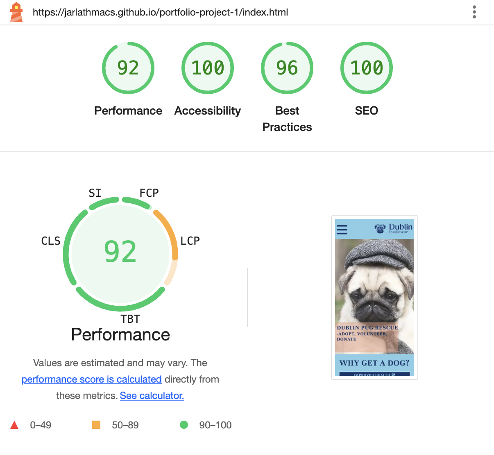

---

# Dublin Pug Rescue

The Dublin Pug Rescue website is a showcase for this organization, which seeks to rehome pugs anywhere on the island of Ireland.  It targets anyone who is at all interested in owning a dog, encourages rehoming or adoption, and shows a selection of pugs available for same.  It also allows users to register their interest - whether in adoption, fostering, volunteering, or donating.

## Features 

### Existing Features

- __Navigation Bar__

- This appears at the top of all 4 pages.  The logo is on the right side, which is a link to the home page itself.  
- The links on the left side are to the Home page, Meet our Pugs page, and Contact us page and are uniform across pages.
- These 3 navigation links change color and are underlined when the user hovers the cursor over them, when viewed on small laptops and larger screen sizes (992px and larger).
- These elements ensure the user can easily navigate their way through and around the website.

- __The Home page hero image__

  - Here we have an attractive background image, overlaid with the name of the organization, along with the suggested action words a user might take.
  

- __Why get a dog? section__

  - Multiple possible motivations for, and benefits of, owning a dog are presented, both physical and mental. 
  - Users are encouraged to consider getting any dog first and foremost for all the benefits presented. 

- __Why adopt a dog? section__

  - This section presents the advantages of choosing to adopt a dog, focusing more on the mental and emotional benefits here.
  - Users are presented with 5 strong reasons for adoption when looking for a dog. 

- __The footer__ 

  - The footer has 4 links to social media sites.  The links all open to a new tab to allow for easy navigation for the user. 

- __Meet our Pugs page__

  - The page presents images of a variety of different age pugs, aiming to create interest from users in what the organization's mission is.
  - This section is invaluable to the user as they can see, from a variety of different pugs, hopefully the possibility of further engaging the organization. 

- __Contact us page__

  - Here the user can take action to contact the organization, whether with an interest in adopting, fostering, volunteering, or donating to the organization.  

- __Response page__

  - This page displays after the user has submitted their contact details.  It presents a confirmation and thank you message.  It promises that they will receive a reply within 24 hours, to preserve their interest.

### Possible future features

- Providing more specific details about each pug pictured, biographies, etc.

## Testing 

- The website was tested and works correctly on the following browsers: Chrome, Firefox, Safari.
- Functionality, responsiveness, and appearance were all good.
- The website was checked by using devtools to make sure it looks good on all screen sizes.
- Manual testing showed all features work as intended.
- The contact us form works as intended, and includes validation.

### Validator Testing 

- HTML
  - No errors were returned when passing through the official W3C validator.
- CSS
  - No errors were found when passing through the official (Jigsaw) validator.
- Lighthouse
  - Accessibility of color palette used, and alt attributes, etc. was confirmed.

### Unfixed Bugs

No unfixed bugs.

## Deployment

- The site was deployed to GitHub pages.  The steps for deployment are as follows: 
  - In the GitHub repository, click on the Settings tab.  On the left menu, click on the pages option.
  - Under the build and deployment, under branch, select main and root options.  Click the save button. 

The live link can be found here - (https://jarlathmacs.github.io/portfolio-project-1/index.html)

## Credits 

### Content 

- The HTML code to make the social media links in the footer was taken from the Love Running project.
- The CSS code in the media query for >=1200px for the reasons to own a dog section, is taken from the Love Running project.
- The icons in the footer and throughout the website were taken from [Font Awesome](https://fontawesome.com).
- The text used in the Why get a dog section was taken from (https://newsnetwork.mayoclinic.org/discussion/mayo-clinic-q-and-a-how-owning-pets-can-lead-to-a-healthier-lifestyle)
- The text used in the 5 Reasons to adopt section was taken from (https://www.aspca.org/news/10-reasons-adopt-shelter-dog)

### Media

- The favicon and logo were created using the website [Brandmark](https://brandmark.io)
- The hero image was taken from (https://www.pugsandkisses.com/listing/898987938/pug-wall-art-hats-and-ties-pug-art-print)
- The images used for the Meet our Pugs page were taken from [Austin Pug Rescue](https://austinpugrescue.com)
- The image for the circle-cover-bg element and the Contact us page were taken from (https://www.instagram.com/ring0thepug)
- The image in the 5 Reasons to adopt was taken from (https://www.google.com/url?sa=i&url=https%3A%2F%2Fespace-trail-du-couserans.com%2F%3Fs%3Dpugs-life-movie-poster-%25E2%2580%2593-your-art-by-you-bb-Ayd6LWfl&psig=AOvVaw2trlyuYa4xoO13IRaztsVm&ust=1721712418610000&source=images&cd=vfe&opi=89978449&ved=0CBEQjRxqGAoTCIiC5ez0uYcDFQAAAAAdAAAAABC1EQ)
